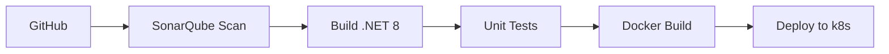

# Documentação Técnica da Arquitetura
## Video Processing Platform v1.0

## 1. Visão Geral
**Objetivo**: Plataforma escalável para processamento assíncrono de vídeos com:

- Autenticação JWT integrada
- Notificações em tempo real via e-mail
- Monitoramento de status de processamento

### Requisitos Não-Funcionais Chave:

| Requisito                 | Implementação                        |
|---------------------------|--------------------------------|
| Processamento paralelo    | Kubernetes (3 réplicas) + RabbitMQ |
| Resiliência a picos      | Filas persistentes + Dead Letter Queue |
| Segurança                | JWT + BCrypt para senhas |
| Escalabilidade           | Horizontal via Kubernetes |
| Disponibilidade          | Health Checks + Circuit Breaker (Polly) |

## 2. Componentes Principais

### 2.1 AuthService
**Funcionalidades:**
- Registro/login de usuários (BCrypt hashing)
- Geração/validação de JWT (HS256)
- Integração com RabbitMQ (`user.created` event)

### 2.2 VideoProcessingService
**Workflow:**
```plaintext
1. Upload vídeo → Azure Blob (Hot Tier)  
2. Publica mensagem RabbitMQ (video.process)  
3. FFmpeg extrai frames (paralelizado)  
4. Gera ZIP → Notifica via notification.events  
```

### 2.3 NotificationService
**Fluxo:**
```plaintext
1. Consome notification.events  
2. Envia e-mail com anexo (FluentEmail)  
3. Atualiza status no SQL Server (Retry Policy)  
```

**Configurações SMTP:**
```plaintext
SMTP Host: Configurado via appsettings.json  
Template Engine: Razor (para corpo dinâmico)  
```

## 3. Comunicação entre Serviços

| Canal              | Protocolo | Descrição                       |
|--------------------|----------|---------------------------------|
| user_exchange     | AMQP     | Eventos de criação de usuário |
| video.process     | AMQP     | Inicia processamento de vídeo |
| notification.events | AMQP   | Notificações + DLQ configurada |

## 4. Estratégia de Resiliência

| Componente         | Tática                                |
|--------------------|------------------------------------|
| RabbitMQ         | Persistent Messages + HA Policy   |
| SQL Server      | Transações ACID + RetryOnFailure  |
| Processamento Vídeo | Circuit Breaker (Polly) + Timeout 10min |
| Azure Blob      | Geo-Redundant Storage (GRS)        |

## 6. CI/CD Pipeline



**Critérios de Qualidade:**
- Coverage mínimo: **80%** (xUnit)
- Zero vulnerabilidades Críticas (SonarQube)

## 7. Decisões de Design

| Decisão                           | Motivação               | Trade-off                  |
|----------------------------------|------------------------|----------------------------|
| FFmpeg local vs Azure Media Services | Custo reduzido        | Manutenção de bins        |
| SQL Server vs NoSQL              | Transações ACID para status | Escalabilidade vertical |
| RabbitMQ vs Service Bus          | Custo + Controle       | Gerenciamento self-hosted |

**Monitoramento**: SonarQube + RabbitMQ Management UI
